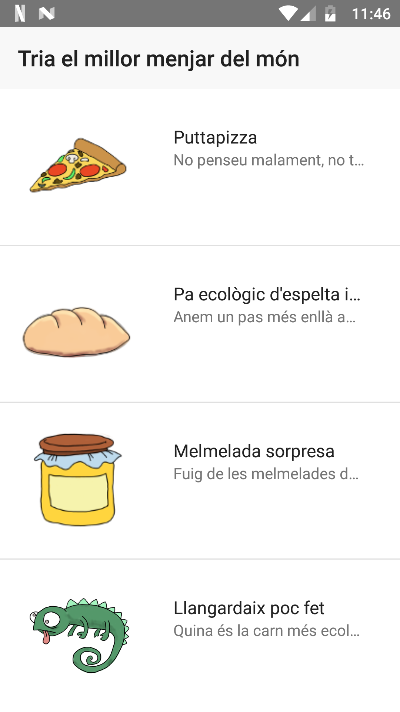
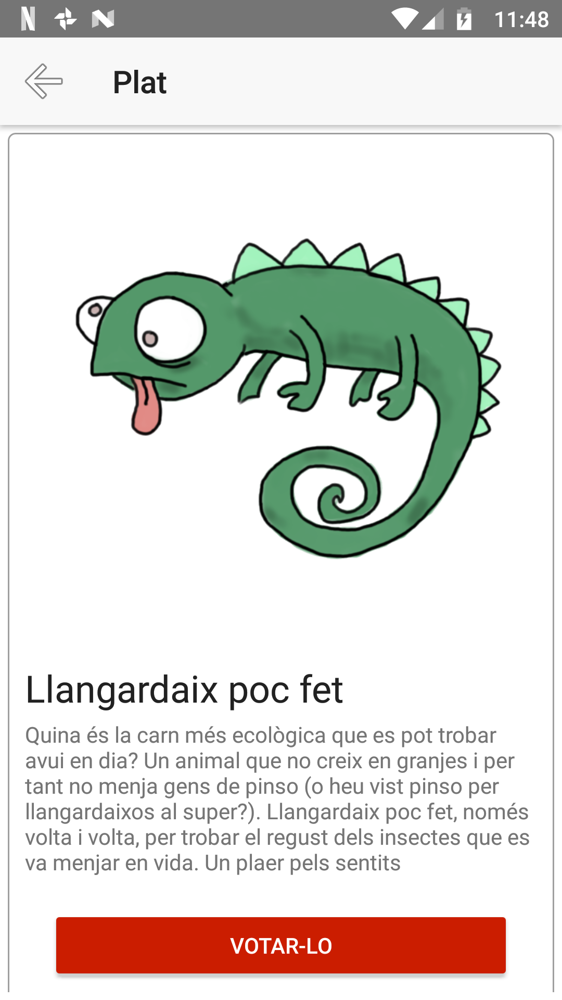
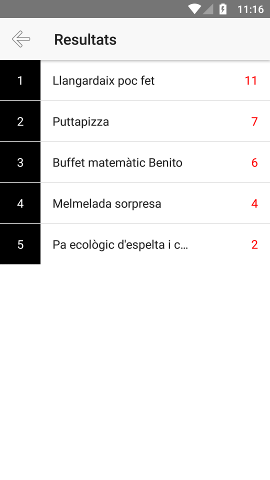
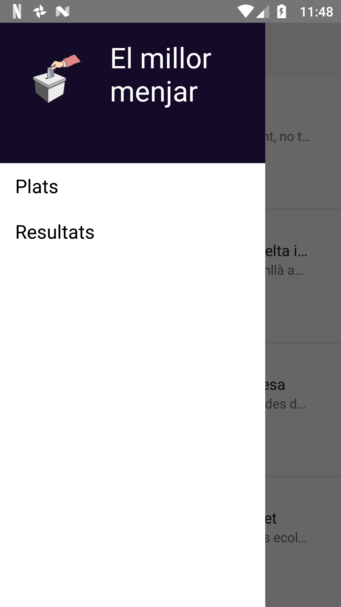

# ElMillorMenjar
Provant Nativescript amb Angular4 + Firebase per fer una aplicació mòbil amb Javascript :-P

## Sistema de votació

La idea és fer un sistema de votació que permeti als usuaris identificats votar quin és el millor plat del món d'una llista 
que es proporciona a partir de les dades que es troben a Firebase.

Els usuaris s'identifiquen a través d'un correu electrònic i una contrasenya. Es fa servir l'autenticació Firebase per 
tant abans de poder entrar es poden registrar en el sistema.

(Pendent de captura)

Un cop identificat l'usuari, el sistema mostra una llista amb els plats disponibles per votar:

I al clicar a sobre d'una de les opcions se'n veuen les característiques: 

En aquesta pantalla es pot votar pel plat i serem redirigits a la pantalla amb els resultats:

En la llista de plats hi ha un menú lateral que ens permet arribar als resultats sense votar:

