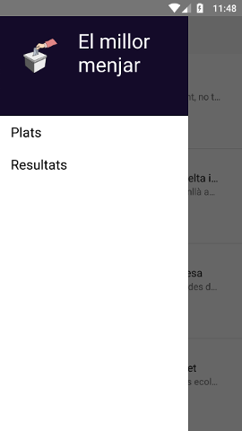

# ElMillorMenjar
Provant Nativescript amb Angular4 + Firebase per fer una aplicació mòbil amb Javascript :-P

## Sistema de votació

La idea és fer un sistema de votació que permeti als usuaris identificats votar quin és el millor plat del món d'una llista que se'ls hi proporciona a partir de les dades que es recuperen des de Firebase.

Firebase es fa servir com a:

* mètode d'autenticació
* Font de dades de les possibles opcions de vot
* Portar el recompte dels vots rebuts per cada opció

## Funcionament

La identificació dels usuaris es fa a través d'un correu electrònic i una contrasenya.  

Els usuaris abans de poder entrar, si no tenen compte, es poden registrar en el sistema clicant en la opció "Registrar-se". El registre només requereix un correu electrònic i una contrasenya (per ara no s'envia correu de confirmació, i per tant el correu pot ser fals, però és trivial forçar la confirmació del correu electrònic amb Firebase)

Un cop identificat l'usuari, el sistema mostra una llista amb les opcions disponibles per votar:

I al clicar a sobre d'una de les opcions es mostren les característiques i l'usuari pot votar pel plat o tornar enrere a la llista de plats (per ara es poden votar tantes vegades com calgui)

 

En cas de que l'usuari voti, és redirigit a la pantalla que mostra els resultats ordenats de gran a petit:

Els resultats es van actualitzant *en temps real* a mesura que els altres usuaris de l'aplicació van votant: Un usuari pot veure com van evolucionant els resultats simplement mirant aquesta pantalla

Quan s'està en la llista de plats es pot fer aparèixer un menú lateral (com a Twitter) que permet arribar als resultats sense haver de votar (no em feia falta per res, però ja que fem proves ...):

O sigui:

## Instal·lació dels requeriments

Per poder-lo usar cal tenir Node instal·lat perqu descarregarà les dependències amb `npm`. Primer s'instal·la Nativescript (si no el teniu):

    npm install -g nativescript
 
Es pot comprovar que ho teniu tot a punt amb:

    tns doctor
    
> L'error més habitual és no tenir definit el directori on teniu el SDK d'Android. 
En Linux (Bash) es defineix a .profile (amb el directori correcte):
>
>    export ANDROID_HOME=/home/usuari/Android/SDK

## Executar el programa

Es clona el projecte: 
 
    git clone https://github.com/utrescu/ElMillorMenjar.git
    cd ElMillorMenjar
 
 Per executar-lo en Android
 
     tns run android

En IOS es semblant (però cal estar en un Mac i tenir XCode)

    tns run ios

## Configurar Firebase 

Per tenir suport d'autenticació i base de dades cal: 

- Crear un compte a [Firebase](https://firebase.google.com/)
- Crear un projecte i:
    - Activar autenticació per `email/password`
    - importar el fitxer `/api-server/db.json` a la base de dades
    - Penjar les imatges de `/api-server/imatges` a 'Storage'
- Des del menú principal de la consola s'afegeix una aplicació Android o IOS (o les dues)
- Després s'ha de descarregar el fitxers de configuració de cada plataforma a la carpeta App_Resources corresponent (només les que calguin):
    - Android: posar el fitxer `google-services.json` al directori `/app/App_Resources/Android`
    - IOS: posar el fitxer `GoogleService-Info.plist` al directori `/app/App_Resources/iOS`
