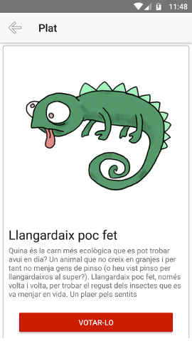

# ElMillorMenjar
Provant Nativescript amb Angular4 + Firebase per fer una aplicació mòbil amb Javascript :-P

## Sistema de votació

La idea és fer un sistema de votació que permeti als usuaris identificats votar quin és el millor plat del món d'una llista que se'ls hi proporciona a partir de les dades que es recuperen des de Firebase.

La identificació dels usuaris s'identifiquen a través d'un correu electrònic i una contrasenya (Per ara no s'envia correu de confirmació però és trivial fer-ho amb Firebase)

* Els usuaris abans de poder entrar si no tenen comptes s'han de registrar en el sistema clicant en la opció "Registrar-se"

Un cop identificat l'usuari, el sistema mostra una llista amb els plats disponibles per votar:

I al clicar a sobre d'una de les opcions se'n veuen les característiques i es pot votar pel plat o tornar enrere a la llista de plats:

 

En cas de votar l'usuari és redirigit a la pantalla que mostra els resultats ordenats de gran a petit:

Els resultats es van actualitzant *en temps real* a mesura que els altres usuaris de l'aplicació van votant: Un usuari pot veure com van evolucionant els resultats simplement mirant aquesta pantalla

Quan s'està en la llista de plats es pot fer aparèixer un menú lateral (com a Twitter) que permet arribar als resultats sense haver de votar (no em feia falta per res, però ja que fem proves ...):

